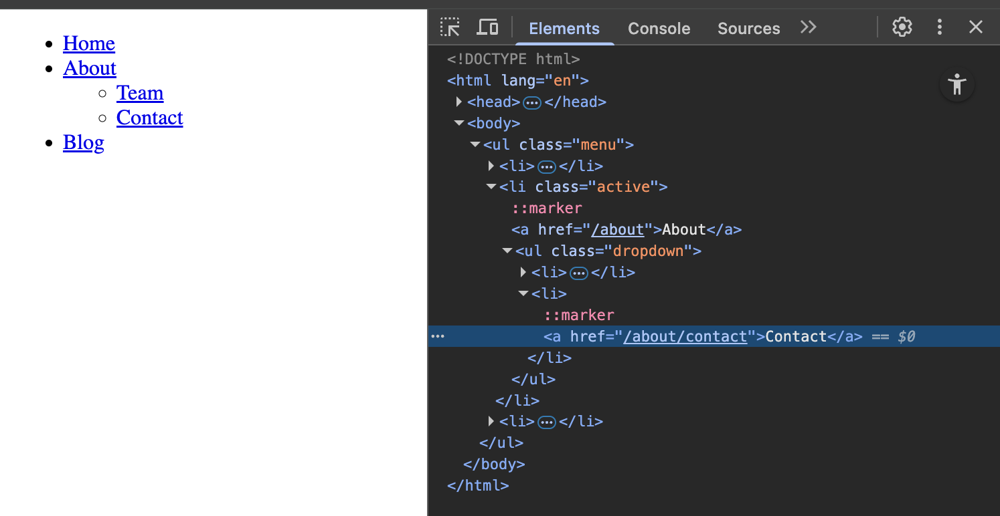

<h1>
  <span class="headline">Pre-Selenium: The DOM Tree</span>
  <span class="subhead">DOM relationships and Selenium selectors</span>
</h1>

**Learning objective:** Explain how parent-child and sibling relationships influence the success of Selenium selectors.

## Why relationships matter in real automation

Suppose you’re automating a large website, like a travel booking site. The “Book Now” button may appear in multiple places—perhaps in both a popup and the main content.

If your Selenium selector is too broad (for example, selecting by the button’s tag alone), your script might select the wrong button—or fail if the page layout shifts.

By using parent-child and sibling relationships in your selectors, you can:

- Target exactly the “Book Now” button inside the section you intend
- Build selectors that will not break if unrelated content elsewhere on the page is updated
- Avoid accidental clicks in the wrong area, which could break your automation flow

## Selector specificity in practice

Let’s use a practical example: a navigation menu.

```html
<ul class="menu">
  <li><a href="/">Home</a></li>
  <li class="active">
    <a href="/about">About</a>
    <ul class="dropdown">
      <li><a href="/about/team">Team</a></li>
      <li><a href="/about/contact">Contact</a></li>
    </ul>
  </li>
  <li><a href="/blog">Blog</a></li>
</ul>
```



<br>

### Use case 1: Select only the “Contact” link inside the dropdown.

- A selector like `.menu a` matches all links in the menu.
- A more precise, relationship-aware selector:

```css
ul.menu > li.active > ul.dropdown > li > a[href="/about/contact"]
```

This path follows each parent and child, leaving no room for ambiguity.

### Use case 2: Select only the “Blog” link, based on sibling order.

- Use the last `<li>` sibling approach:

```css
ul.menu > li:last-child > a
```

These selectors depend on understanding which elements are siblings and their order within the parent.

> 🏆 Best practice: The more clarity you have about relationships, the fewer surprises you’ll encounter when the page changes.

### Avoiding common pitfalls

- **Selecting by tag alone:**  
  Selectors like `li`, `div`, or `a` without further context are typically too broad.

- **Skipping levels:**  
  Using selectors that jump from a parent to a grandchild (such as `ul .dropdown a`) risks breaking if intermediate levels change.

- **Sole reliance on sibling order:**  
  Selectors like `li:nth-child(2)` can break if menu items are reordered later.

- **Not accounting for shared class names:**  
  Many sites use classes like `.active`, `.dropdown`, or similar on several elements. Only combining classes with parent–child chains avoids mismatches.

- **Using visible text alone:**  
  It’s tempting to identify a link just by what it says—like selecting the “Contact” link based only on the word “Contact.” But in CSS, you can’t target elements by their visible text. Instead, rely on attributes (like `href`) or structure to be more accurate.

```css
  a[href="/about/contact"]
```

> ⚠ If you write selectors without accounting for these relationships, your automation may work today—but will likely fail as soon as the webpage is updated.

### Checklist for building robust selectors

- Start with a unique parent if one exists (like an ID).
- Use direct child combinators when needed (`>` in CSS or `/` in XPath).
- Combine attribute filters, class names, and structural positioning for higher specificity.
- Test selectors in Chrome DevTools to ensure you only match your target element.
- Review and update selectors whenever the page structure changes.

## Applied coding: From DOM to Python with Selenium

See these relationships in action—here’s how your selectors map directly to Selenium code.

**Python with Selenium and CSS selector:**

```python
from selenium import webdriver

driver = webdriver.Chrome()
driver.get("http://example.com")

# Find the "Contact" link using DOM relationships
contact_link = driver.find_element(
    "css selector",
    'ul.menu > li.active > ul.dropdown > li > a[href="/about/contact"]'
)
contact_link.click()
```

> 🧠 Notice how the structure you saw in DevTools is exactly how you build your path in code. The more you practice mapping these relationships, the faster and more accurate your selectors will be.
