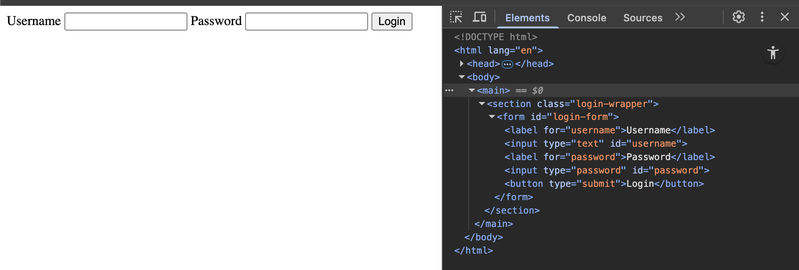
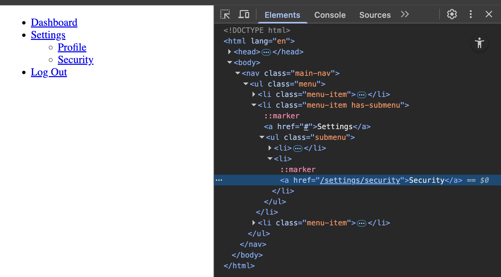

<h1>
  <span class="headline">Pre-Selenium: The DOM Tree</span>
  <span class="subhead">Exploring DOM Nesting with DevTools</span>
</h1>

**Learning objective:** Use Chrome DevTools to explore and interpret DOM nesting in real web pages.

As a Python developer, you’re already familiar with structured data—dictionaries within dictionaries, lists within objects. The DOM (Document Object Model) is similarly structured. HTML elements are organized in a nested hierarchy, and **understanding this structure is essential for building accurate, reliable Selenium selectors**.

This lesson focuses on:

- Visually navigating the DOM in Chrome DevTools
- Connecting the _visual layout_ of a webpage to the _underlying structure_
- Practicing how to trace parent–child–sibling relationships in the DOM to support precise element targeting

### Why DOM nesting matters for automation

Selenium selectors often depend on **context**—not just what an element is, but where it lives in the DOM. Knowing how an element is nested enables you to:

- Avoid false matches
- Build robust selectors that survive layout changes
- Work effectively in complex, component-based UIs

### Navigating the DOM in Chrome DevTools

To view the DOM tree in DevTools:

- Right-click on any part of a webpage and choose **Inspect**
- Or use:
  - <kbd>Ctrl</kbd> + <kbd>Shift</kbd> + <kbd>I</kbd> (Windows/Linux)
  - <kbd>Command</kbd> + <kbd>Option</kbd> + <kbd>I</kbd> (Mac)

You’ll land in the **Elements** tab, where HTML is presented as a collapsible, nested structure. Click the arrow (`▶`) beside a tag to expand its child elements.

Each HTML tag (ex:`<div>`, `<form>`, `<button>`) is a **node** in this tree, and each node has a **position**:

- **Parent:** The container for other elements
- **Child:** Nested inside a parent
- **Sibling:** Shares the same parent as other elements

> 🧭 Navigating the DOM is like browsing through folders in a file system. Each level of indentation shows a deeper nesting level.

### Real-world example: Nested structure in a login interface

Here’s a simplified HTML example of a login form commonly found in real applications:

```html
<main>
  <section class="login-wrapper">
    <form id="login-form">
      <label for="username">Username</label>
      <input type="text" id="username" />

      <label for="password">Password</label>
      <input type="password" id="password" />

      <button type="submit">Login</button>
    </form>
  </section>
</main>
```

In DevTools, this would appear as a nested structure:

- `<main>` is the top-level parent
- `<section class="login-wrapper">` is its child
- `<form id="login-form">` is nested within that section
- `<label>`, `<input>`, and `<button>` are children of the form—and **siblings to each other**



<br>

This kind of structure is common in dashboards, CMS interfaces, and multi-section forms. A single form may live inside modals, tabs, or card layouts, which adds complexity to targeting elements accurately.

### How nesting impacts selector precision

Imagine you’re trying to write a Selenium selector that clicks the “Login” button. You might start with a basic CSS selector:

```css
button[type="submit"]
```

If the page has **multiple** submit buttons labeled “Login,” this could fail or click the wrong one.

A better selector that accounts for structure might be:

```css
form#login-form > button[type="submit"]
```

Or with more nesting context:

```css
main > section.login-wrapper > form#login-form > button[type="submit"]
```

> ✅ These selectors are more resilient because they use **nesting context** to identify the exact button inside the login form.

<div class="activity guided-walkthrough">
  <h2 class="title">Automating navigation to a nested link</h2>
  <span class="minutes">5 min</span>
</div>

Write a **CSS selector** to reliably click the **“Security”** link nested inside the **Settings** submenu.

```html
<nav class="main-nav">
  <ul class="menu">
    <li class="menu-item">
      <a href="/dashboard">Dashboard</a>
    </li>
    <li class="menu-item has-submenu">
      <a href="#">Settings</a>
      <ul class="submenu">
        <li><a href="/settings/profile">Profile</a></li>
        <li><a href="/settings/security">Security</a></li>
      </ul>
    </li>
    <li class="menu-item">
      <a href="/logout">Log Out</a>
    </li>
  </ul>
</nav>
```

### Strategy:

1. **Avoid selecting all `<a>` tags** — there are many.
2. **Target the structure**: find the `submenu`, then the correct `<li>`, then the `<a>`.



### Targeted CSS selector:

```css
.main-nav .has-submenu .submenu a[href='/settings/security'];
```

This selector reads as:

> Inside `.main-nav`, find a `.has-submenu` item → then its `.submenu` → then a link with a specific `href`.

### Why this works:

- It uses **structural context** to avoid accidentally clicking “Profile” or “Log Out.”
- It’s **specific to the nesting pattern**, so even if similar links exist elsewhere on the page, this one targets only the dropdown.

### Reflect

- Were any elements **more deeply nested** than you expected?
- How does tracing **parents and siblings** help you build a better selector?
- What DevTools features helped you understand the **structure quickly**?

By practicing how to **navigate, interpret, and trace the DOM**, you're gaining the insight needed to write selectors that are accurate, durable, and automation-ready.
