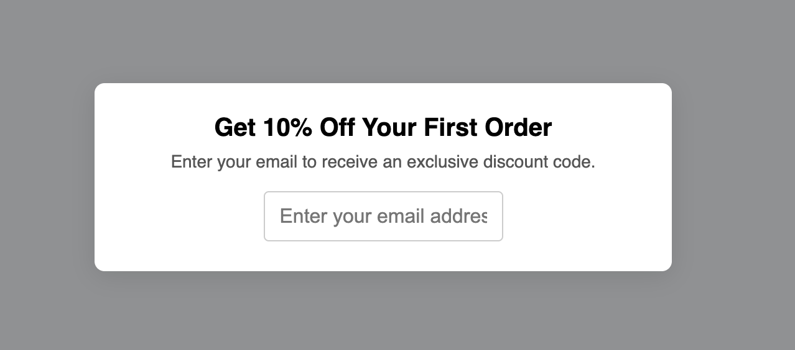

<h1>
  <span class="headline">Pre-Selenium: The DOM Tree</span>
  <span class="subhead">Handling Deeply Nested Structures</span>
</h1>

**Learning objective:** Recognize when deeply nested structures require compound or contextual selectors for reliability.

Modern webpages often use complex, deeply nested HTML—especially when using frameworks, modals, or reusable UI components. In DevTools, what looks like a simple input on the page might be buried within 5+ layers of containers.

As you’ve already seen, writing accurate selectors depends not just on what the element is, but **where** it is.

## Why deep nesting matters for Selenium selectors

- **Broad selectors fail silently**:  
  A simple selector like `input[name="email"]` might match multiple elements (one in a modal, another in a form), leading to test flakiness or failures.

- **Nesting = ambiguity without context**:  
  The deeper the nesting, the more likely similar structures appear elsewhere. Context is key to avoiding accidental matches.

- **Specificity gives resilience**:  
  Anchoring your selector to a **stable parent** (like a `form` with an ID) makes it far more reliable, even if the layout changes.

## Real-world example

Let’s say you’re automating interaction with an **email discount sign-up modal**:

```html
<div class="modal">
  <div class="modal-content">
    <h2>Get 10% Off Your First Order</h2>
    <p>Enter your email to receive an exclusive discount code.</p>
    <form id="signup">
      <div class="form-row">
        <div class="input-group">
          <input
            type="text"
            name="email"
            placeholder="Enter your email address"
          />
        </div>
      </div>
    </form>
  </div>
</div>
```

Here is the UI:



### What not to do:

```css
input[name="email"]
```

> This is too broad—if another input with the same `name` exists elsewhere on the page (ex:in a footer or another form), your test might interact with the wrong one.

### Better approach:

```css
form#signup .input-group input[name="email"]
```

> 🎯 This selector starts from a uniquely identifiable form and includes structural context to reliably target only the input in the discount modal.

### Compound and contextual selectors in action

- **Compound selectors:** Combine tag, class, ID, and attribute information to make selectors unique.
- **Contextual selectors:** Use ancestor–descendant or parent–child relationships to add more context, reducing false matches.

```css
form#signup div.input-group input[name="email"]
```

This ensures Selenium finds the right email field, no matter how many there are elsewhere in the DOM.

### Practical strategy for selecting deeply nested elements

1. **Start from a unique ancestor**  
   Look for the nearest parent with a stable ID or class (ex: `form#signup`, `.modal-content`).

2. **Add structural context**  
   Include key wrapper elements between the ancestor and the input.

   Example:

   ```css
   form#signup div.input-group input
   ```

3. **Test in DevTools**  
   Use <kbd>Cmd/Ctrl</kbd> + <kbd>F</kbd> in the Elements panel to enter selectors and confirm they highlight only your intended input.

<div class="activity guided-walkthrough">
  <h2 class="title">Quick Test in DevTools</h2>
  <span class="minutes">5 min</span>
</div>

1. **Copy the HTML snippet** from above into a new `.html` file and open it in your browser.

2. **Open Chrome DevTools**:  
   Right-click anywhere on the page and choose **Inspect**, or press:

   - <kbd>Ctrl</kbd> + <kbd>Shift</kbd> + <kbd>I</kbd> (Windows/Linux)
   - <kbd>Command</kbd> + <kbd>Option</kbd> + <kbd>I</kbd> (Mac)

3. **Search for elements using selectors**:  
   In the **Elements** panel, press:

   - <kbd>Ctrl</kbd> + <kbd>F</kbd> (Windows/Linux)
   - <kbd>Command</kbd> + <kbd>F</kbd> (Mac)

4. **Try entering these CSS selectors**:

   - `input[name="email"]` → Works here, but could match too broadly on larger pages
   - `form#signup input[name="email"]` → More scoped and intentional
   - `form#signup .input-group input` → Most precise, includes structural context

> ✅ In this example, each selector matches the same input—but on a real site with multiple forms or modals, **more specific selectors help avoid accidental matches** and make your automation more reliable.

### Connecting to Selenium code

In Selenium selecting the correct element would look like this:

```python
email = driver.find_element(
"css selector",
'form#signup .input-group input[name="email"]'
)
```

> You’re not just locating an element—you’re giving Selenium a **reliable path** through a complex DOM structure.

## When to use compound or contextual selectors

Use them when:

- You’re working in modals, popups, or repeated components
- A basic selector (like `input[name="email"]`) matches too many elements
- You want your test to **keep working** even if the page grows more complex

> The deeper the nesting, the more important it is to **anchor**, **combine**, and **test**.
