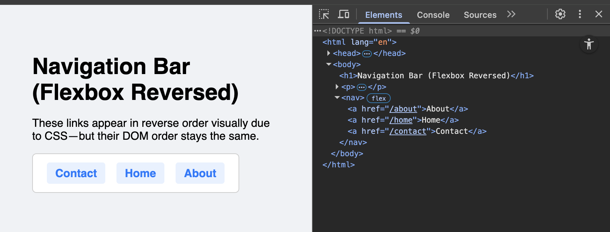
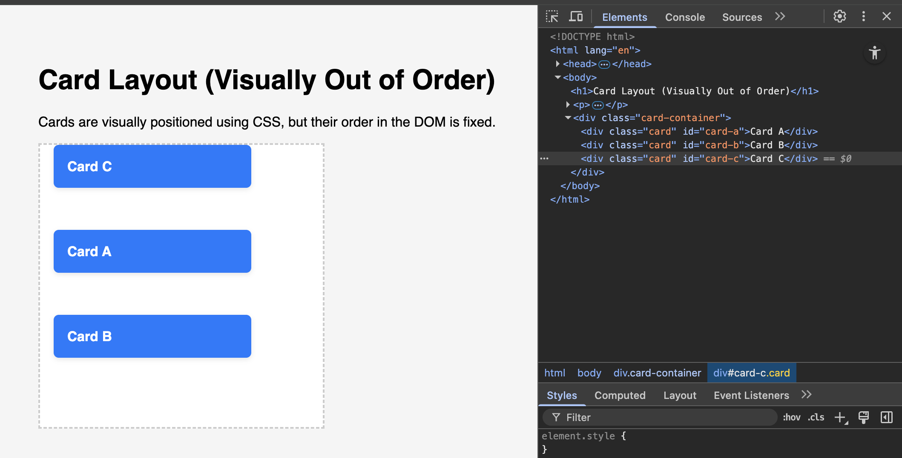

<h1>
  <span class="headline">Pre-Selenium: The DOM Tree</span>
  <span class="subhead">Mapping visual layout to DOM structure</span>
</h1>

**Learning objective:** Map the visual layout of a webpage to its DOM structure to guide selector strategy.

Imagine you are using Selenium to automate steps on a webpage. Sometimes, what you see in your browser and what you see in the DOM tree do not line up the way you might expect. As a Python developer already familiar with basic HTML and DOM hierarchies, the next skill is to confidently link each visual interface element to its true place in the DOM.

## When the screen fools your eyes: Visual layout vs. DOM order

It is natural to assume that the visual order of elements on a webpage—such as buttons, links, and form fields—matches how they appear in the HTML. However, with modern CSS layout tools, elements can be positioned on the screen in almost any order, independent of their DOM placement.

> 💡 Imagine arranging a group photo. The people standing in the front row may not be first on the guest list. Similarly, just because a button appears first on the screen, it might not be the first element in the DOM.

## Example 1: Navigation bar with CSS flexbox

Suppose you see a navigation bar with three links, visually arranged like this:

```
Contact | Home | About
```

But if you inspect the HTML, you may find:

```html
<nav>
  <a href="/about">About</a>
  <a href="/home">Home</a>
  <a href="/contact">Contact</a>
</nav>
```

A developer may have used CSS flexbox to reverse the visual order:

```css
nav {
  display: flex;
  flex-direction: row-reverse;
}
```



> Visually, the links appear in the opposite order — but in the DOM, "About" still comes first.  
> This is a key reason why Selenium and DevTools rely on **DOM order**, not **visual layout**.

> ⚠ When writing Selenium selectors, you always target elements by their position in the DOM—not their visual position on the page.

### Why this matters for your automation scripts

If your Selenium selector targets “the first button” based on what you see visually, you may select the wrong button if you do not account for DOM order.

For example:

```python
# Incorrect: Assumes the leftmost button is DOM child 1
leftmost_btn = driver.find_element("css selector", ".container > div:nth-child(1)")
# May accidentally select "First", not "Third"
```

Correct approach—base your selector on the actual DOM position:

```python
# Correct: Selects the true third child, which appears leftmost due to CSS
leftmost_visual_btn = driver.find_element("css selector", ".container > div:nth-child(3)")
```

> 💡 Visual layout is not a reliable guide for automation. The DOM structure is.

## Example 2: Cards positioned with absolute CSS

Imagine a layout with three cards visually stacked like this:

```
[ Card C ]
[ Card A ]
[ Card B ]
```

But the HTML is:

```html
<div class="card-container">
  <div class="card" id="card-a">Card A</div>
  <div class="card" id="card-b">Card B</div>
  <div class="card" id="card-c">Card C</div>
</div>
```

The developer used CSS to move the cards visually out of order:

```css
.card-container {
  position: relative;
}

.card#card-a {
  position: absolute;
  top: 100px;
}

.card#card-b {
  position: absolute;
  top: 200px;
}

.card#card-c {
  position: absolute;
  top: 0;
}
```



> Visually, Card C appears at the top — but in the DOM, it’s the last element.  
> Selenium doesn’t “see” the layout — only the structure.

### Why this matters for your automation scripts

If your Selenium selector targets “the first button” based on what you see visually, you may select the wrong button if you do not account for DOM order.

For example:

```python
# Incorrect: Assumes the leftmost or topmost element is DOM child 1
top_card = driver.find_element("css selector", ".card-container > div:nth-child(1)")
# May accidentally select "Card A" instead of "Card C"
```

Correct approach—base your selector on the actual DOM structure:

```python
# Correct: Selects the true last card in the DOM (visually on top)
top_card = driver.find_element("css selector", ".card-container > div:nth-child(3)")
```

> 💡 Visual layout is not a reliable guide for automation. The DOM structure is.

By consistently mapping from the visual page to the DOM through DevTools, you can approach every automation challenge with clarity and precision—making your selectors accurate and resilient across any site or layout.

### ✅ Key Takeaway

**Avoid using `:nth-child()` or positional selectors when visual layout has been altered by CSS.**

Modern CSS techniques—like `flex-direction: row-reverse` or `position: absolute`—can make the **first element on the screen** appear in a different position than it appears in the **DOM**.

> Always inspect the DOM structure using Chrome DevTools and write selectors based on element hierarchy, not what you see visually on the page.

**Better strategy:** Anchor your selectors to stable parent elements or use attributes (like `id`, `class`, or `name`) instead of relying on position.

```css
/* Less reliable on visually reordered layouts */
.container > div:nth-child(1)

/* More reliable */
.card-container > div#card-c
```

> 🔍 DOM structure is what Selenium interacts with—not visual layout. If in doubt, check the DOM with DevTools.
